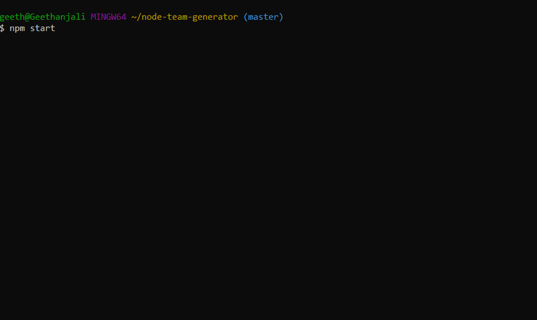
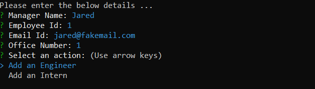
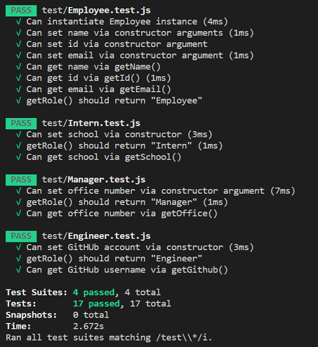

# Team Information Page Generator

## Description
This command-line Node.js application dynamically generates an Information page for a Software Engineering Team based on user input. It  provides users with a quick and easy way to generate a webpage that displays their team's basic information. This enables teams to communicate better with easy access to a team member's emails and GitHub profiles.

## Application Demo

<br><br>

## Sample Output File

Team Information Sample : [sample_output/team.html](sample_output/team.html) <br><br>

## Table of Contents 

- [Installation Instructions](#installation-instructions)
- [Usage Guidelines](#usage-guidelines)
- [Tests](#tests)

## Installation Instructions

- #### Node.js  
This application needs Node.js to execute. To install Node.js, run the appropriate installer from https://nodejs.org/en/download/ and follow the prompts to complete the installation. 

- #### Clone this repo
 Clone this repo to your local machine using:
```shell
git clone `https://github.com/Gveetil/Node-Team-Generator.git`
```

- #### Install packages
You will need to install the inquirer npm package to your environment. <br><br>

 Browse to the folder where you cloned the Repo and install the packages:
```shell
$ npm install 
```

- #### Execute the program
To run the program, browse to the local folder where you cloned the Repo and execute 
```shell
$ npm start 
```
The app should now start executing.<br><br>

## Usage Guidelines

- When the application is executed, first the user is prompted to enter the below information about the team Manager:
    * Manager name 
    * Employee Id (defaults to 1 - the first available employee number) 
    * Email Id 
    * Office Number<br>
- The application validates each of these values to ensure that they are not empty. 
- Additionally, the Employee Id and Office Number need to be positive integers.
- The Email id also validated to ensure it is in the correct format.

- Once the user enters information about the Team Manager, the user is then prompted to add an Engineer / Intern to the team, as below:

 <br><br>

- If the user chooses to add an Enginner, the below details need to be entered:
    * Engineer name 
    * Employee Id (defaults to the next available employee number) 
    * Email Id 
    * GitHub Id<br>

- If the user chooses to add an Intern, the below details need to be entered:
    * Intern name 
    * Employee Id (defaults to the next available employee number) 
    * Email Id 
    * School<br>

- Once the user has added a team member, the 'Generate Team Html' option is available.
- The user can then choose to input any number of team members, and they may be a mix of engineers and interns. 
- When the team information is complete, the user can then choose the 'Generate Team Html' option to generate the webpage.
- The application then generates the team information file in a local folder named `output` and displays a link to the generated file. 


## Tests

This application was built using a Test-driven development approach.
To execute these tests, follow the steps below:

- #### Install Test packages
To execute the tests, you will need to install the jest package to your environment. <br><br>

 Browse to the folder where you cloned the Repo and install the packages:
```shell
$ npm install 
```
- #### Execute Tests
To run the tests, browse to the local folder where you cloned the Repo and execute 
```shell
$ npm run test 
```
The tests should now start executing.<br><br>

- #### Output
The test output is then displayed as below:

 <br><br>


 
